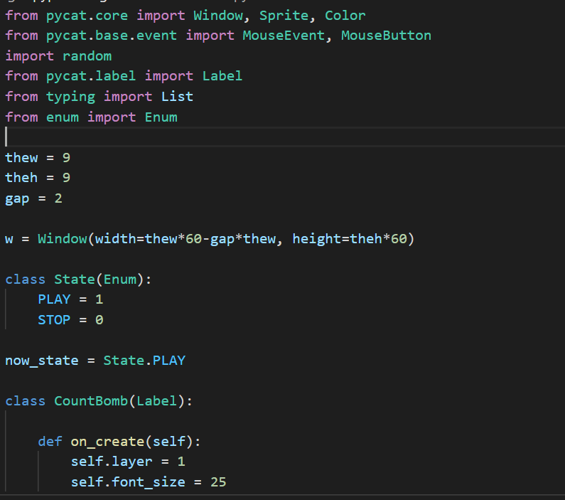
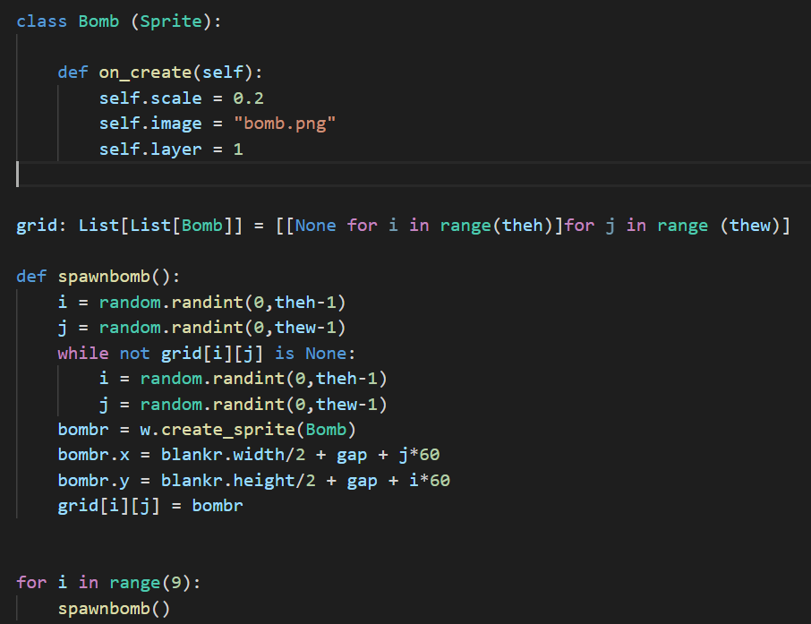
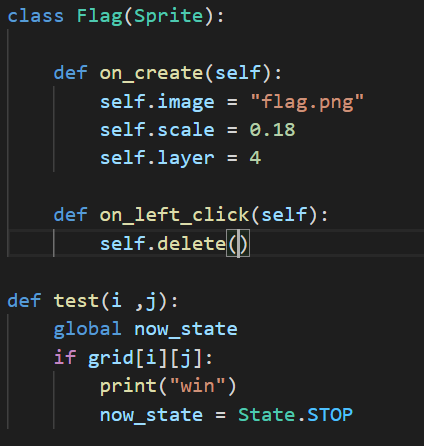
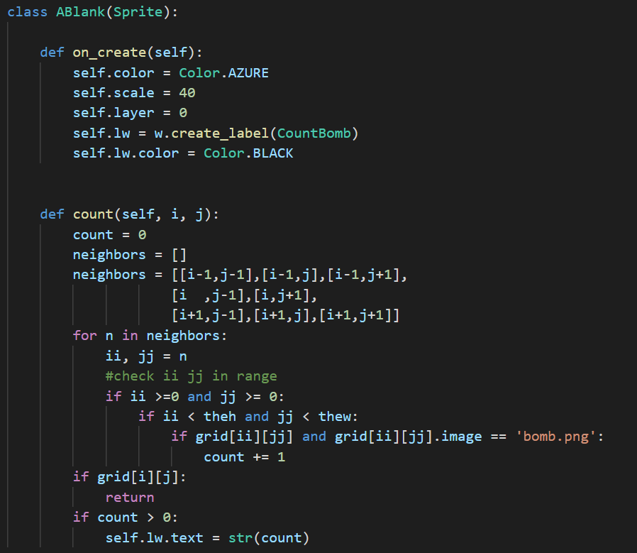
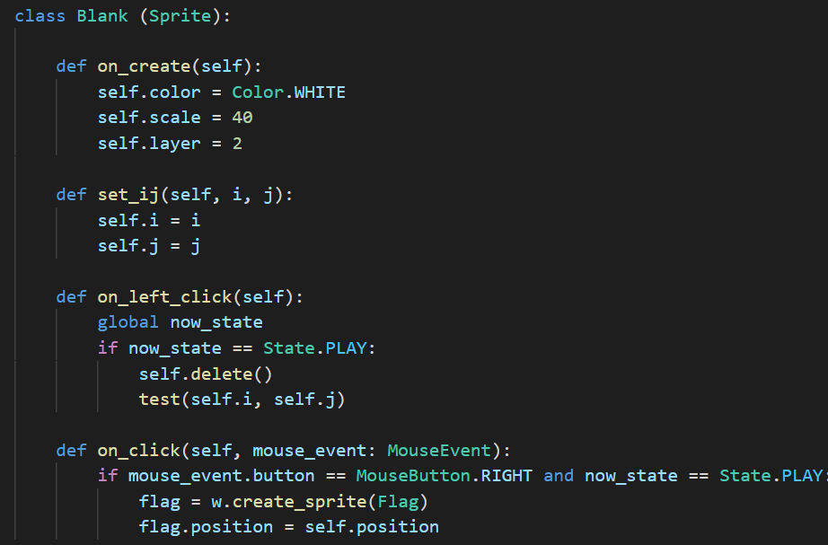

Hi

It my work.

HOW TO PLAY:
    
    1.Press on the white blank.
    
    2.Watch out the numbers showed, it means how many bombs nearby.
    
    3.Rightclick to put flag on white blank, to remind you not to press it.
    
    4.If you not click the bomb , you win
   

Code Picture:

1.Basic Setting:

2.Bomb part:

3.Flag part:

4.Blank part:

        

     
